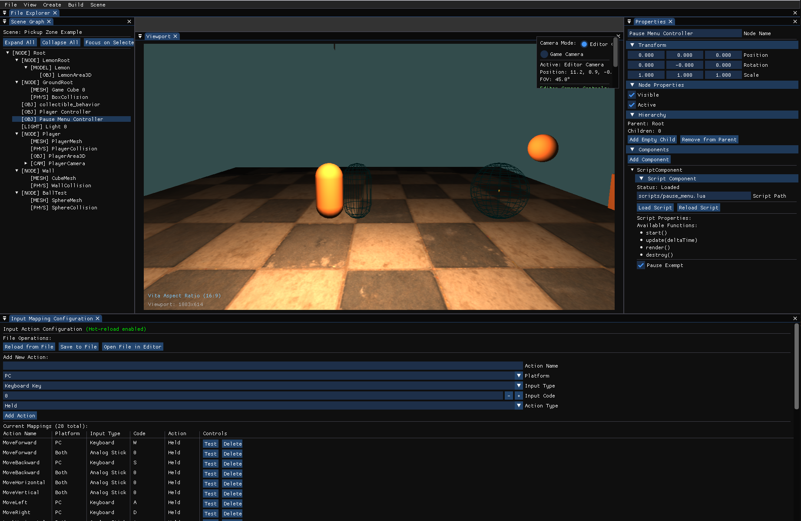

# Game Engine

This project is a cross-platform Game Engine that supports both PS Vita and Linux builds, with a complete editor interface for Linux.

## Features

### Rendering
- [x] Basic 2D Rendering
- [x] Basic 3D Rendering
- [ ] Skyboxes
- [x] Skeletal Animations (GLTF bone animations)
- [x] GLTF/GLB Model Loading
- [x] PBR (with normal map)
- [x] Multi-light Lighting System (Directional, Point, Spot)

### Audio
- [ ] 2D Audio
- [ ] 3D Audio

### Physics
- [x] 3D Physics (Bullet Physics with multithreading support on Vita and Linux)
- [ ] 2D Physics

### Scene and Editor
- [x] Scene System (Load/Save JSON scenes)
- [x] Visual Editor (Scene Graph, Viewport, Properties Panel)
- [x] Input Mapping from Editor
- [x] Lua Hot Reloading
- [x] Component System

### Platform Support
- [x] PS Vita Build
- [x] Linux Build

## Architecture

The game engine follows a modern architecture with:
- **Scene Graph System**: Hierarchical scene organization with transform inheritance
- **Component System**: Modular, composable entity components
- **Cross-Platform Support**: Shared codebase for PS Vita and Linux
- **Editor Interface**: Visual scene editing tools (Linux only)

## Visual References

The `docs/references/` folder contains visual references to help understand the engine:

### Editor Screenshot

**`screenshot_first_demo.png`**: A screenshot showing the editor interface in action. This demonstrates the editor's layout including the scene graph panel, viewport, and properties panel while working with the first game demo scene.



### First Demo Scene Animation

**`demo.gif`**: An animated demonstration of the `first_game_demo` scene running in the game engine. This GIF showcases the gameplay, physics interactions, and visual features of the demo scene, including player movement, physics-based ball interactions, and the overall scene dynamics.


## Directory Structure

```
first_game/
├── game_engine/           # Core game engine
│   ├── include/          # Engine headers
│   │   ├── Core/         # Core systems (Engine, Transform, Time)
│   │   ├── Scene/        # Scene management (SceneNode, SceneManager)
│   │   ├── Components/   # Entity components (Camera, MeshRenderer, Lights...)
│   │   ├── Rendering/    # Rendering system (Renderer, Mesh, Material...)
│   │   ├── Input/        # Input management
│   │   └── Editor/       # Editor system (Linux only)
│   └── src/              # Engine implementation
├── src/                  # Your original game code
├── include/              # Your original game headers
├── assets/               # Game assets (models, shaders, textures)
│   └── scenes/          # Demo scenes (see Demo Scenes section below)
├── editor_main.cpp       # Editor entry point
└── Makefile             # Updated build system
```

## Demo Scenes

The `assets/scenes/` folder contains several demo scenes that showcase different features of the engine:

- **`first_game_demo.json`**: A comprehensive demo scene featuring player movement, physics interactions (kinematic player pushing dynamic objects), static collision walls, and camera controls. This scene demonstrates the physics system, input handling, and scene composition.

- **`drop_ball_scene.json`**: A physics demonstration scene showing dynamic objects interacting with static collision surfaces.

- **`main_menu.json`**: A menu scene demonstrating UI elements and scene transitions.

## Building

### Prerequisites

For Linux development:
```bash
make install-deps          # Install basic dependencies
make install-editor-deps   # Install editor dependencies (includes ImGui)
```

### Dependencies Setup

Some vendor dependencies need to be set up manually:

#### Lua (Required for Vita builds)
```bash
./setup.sh lua  # Setup Lua submodule and build for Vita
```

#### ImGui (Required for editor)
```bash
./setup.sh imgui /path/to/imgui/source  # Copy ImGui files to vendor folder
```

#### All Dependencies
```bash
./setup.sh all /path/to/imgui/source  # Setup both Lua and ImGui
```

#### Other Dependencies
- **JSON**: nlohmann/json (header-only, already included)
- **STB**: stb libraries (header-only, already included)  
- **Bullet Physics**: Already included with Vita builds
- **TinyGLTF**: Already included

**Note**: JSON, STB, and Lua are managed as Git submodules. When cloning the repository, use:
```bash
git clone --recursive <repository-url>
```
Or if already cloned:
```bash
git submodule update --init --recursive
```

### Build Targets

```bash
# Build for PS Vita (original game)
make vita

# Build game for Linux
make linux

# Build editor for Linux
make editor

# Run Linux game
make run

# Run editor
make run-editor

# Debug builds
make debug-linux
make debug-editor

# Clean all builds
make clean
```

## Editor Usage

The editor provides a complete scene editing environment:

### Layout
- **Scene Graph (Left)**: Hierarchical view of scene objects
- **Viewport (Center)**: Real-time scene preview and manipulation
- **Properties (Right)**: Object transform and component properties
- **File Explorer (Bottom)**: Asset browser (planned feature)

### Editor Controls
1. **Scene Graph Panel**:
   - Click nodes to select them
   - Right-click for context menu (create child, delete, etc.)
   - Hierarchical scene organization

2. **Properties Panel**:
   - Edit transform properties (position, rotation, scale)
   - Component-specific properties
   - Real-time value updates

3. **Menu Bar**:
   - File operations (New Scene, Open, Save)
   - View toggles for panels
   - Object creation tools

### Creating Objects
- Use `Create` menu to add new objects:
  - Empty Node: Basic transform node
  - Camera: Camera object with CameraComponent
  - Cube: Mesh object with MeshRenderer
  - Lights: Directional light, Point light and Spot light

## Engine Features

### Scene System
- **SceneNode**: Base scene object with transform and components
- **Transform**: Position, rotation (quaternion), and scale
- **Components**: Modular functionality (Camera, MeshRenderer, etc.)
- **Scene Management**: Load/save scenes, multiple scene support

### Rendering System (Planned)
- **Mesh**: Vertex data management
- **Material**: Shader and property management
- **Renderer**: Scene rendering with camera support
- **Cross-platform**: Same rendering code for Vita and Linux

### Input System
- **Unified Input**: Same input code for both platforms
- **Editor/Game Modes**: Different input handling for editor vs game

## Development Workflow

### For Game Development:
1. Use `make run-editor` to design your scenes visually
2. Save scenes and load them in your game code
3. Test on Linux with `make run`
4. Build for PS Vita with `make vita`

### For Engine Development:
1. Add new components in `game_engine/include/Components/`
2. Implement in `game_engine/src/Components/`
3. Update editor UI for new component properties
4. Test in both editor and game modes

## Documentation

Complete documentation is available in the `docs/` folder:
- [Full Documentation](docs/DOCUMENTATION.md) - Complete guide covering all engine features
- [Component API](docs/TEXT_COMPONENT_API.md) - TextComponent API reference
- [ModelRenderer Guide](docs/README_ModelRenderer.md) - ModelRenderer component guide

