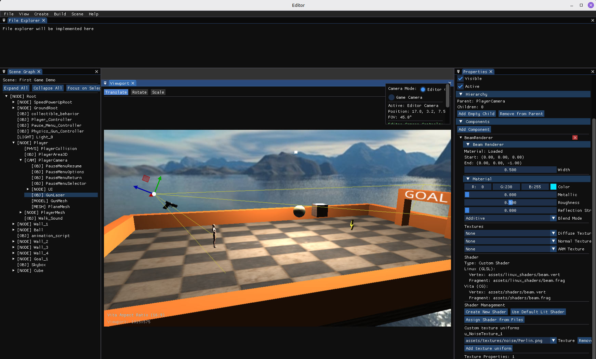

# Game Engine

Cross-platform game engine for **PS Vita** and **Linux**, with a visual editor on Linux.

## Features

### Rendering
- [x] Basic 2D Rendering
- [x] Basic 3D Rendering
- [x] Skyboxes
- [x] Skeletal Animations (GLTF bone animations)
- [x] GLTF/GLB Model Loading
- [x] PBR (with normal map)
- [x] Multi-light Lighting System (Directional, Point, Spot)
- [x] Custom Shader Support (Lit and Unlit, GLSL + CG templates)

### Audio
- [x] 2D Audio
- [ ] 3D Audio

### Physics
- [x] 3D Physics (Bullet Physics with multithreading support on Vita and Linux)
- [ ] 2D Physics

### Scene and Editor
- [x] Scene System (Load/Save JSON scenes)
- [x] Visual Editor (Scene Graph, Viewport, Properties Panel)
- [x] Input Mapping from Editor
- [x] Lua Hot Reloading
- [x] Component System

### Platform Support
- [x] PS Vita Build
- [x] Linux Build

## Architecture

- **Scene Graph**: hierarchy and transform inheritance
- **Component System**: modular entity components
- **Cross-Platform**: shared codebase for Vita and Linux
- **Editor**: scene editing on Linux only

## Visual References

Editor layout (scene graph, viewport, properties):



First demo scene (physics, player, camera):


## Directory Structure

```
first_game/
├── game_engine/           # Core engine
│   ├── include/          # Headers (Core, Scene, Components, Rendering, Input, Editor)
│   └── src/              # Implementation
├── src/                  # Game entry points (vita_main, game_main, Platform)
├── include/              # Game headers
├── assets/               # Scenes, shaders, textures, models
└── Makefile
```

## Demo Scenes

In `assets/scenes/`:

- **first_game_demo.json** — player, physics, collisions, camera
- **drop_ball_scene.json** — physics demo
- **main_menu.json** — menu and scene transitions

## Building

### Linux

```bash
make install-deps          # dependencies (libglfw, glew, lua5.3, etc.)
make install-editor-deps  # editor deps (ImGui is in vendor/)
make linux                 # build game
make editor                # build editor
make run                   # run game
make run-editor            # run editor
```

### PS Vita

Requires [VitaSDK](https://vitasdk.org/) and vitaGL. Set up Lua:

```bash
git submodule update --init --recursive
./setup.sh lua
```

Then:

```bash
make vita
```

Output: `build/first_game.vpk`.

**Running the homebrew**

- **Real Vita**: You need `libshacccg.suprx` on your Vita. See the [Vita troubleshooting guide](https://cimmerian.gitbook.io/vita-troubleshooting-guide/shader-compiler/extract-libshacccg.suprx) for how to obtain and install it.
- **Vita3K**: If you use the [Vita3K](https://vita3k.org/) emulator, install or place `libshacccg.suprx` in Vita3K’s data path so the emulator can load it when running the homebrew.

### Dependencies

- **Lua**: submodule, build for Vita with `./setup.sh lua`
- **ImGui**: `./setup.sh imgui /path/to/imgui` for editor
- **All**: `./setup.sh all /path/to/imgui`
- JSON, STB, Bullet, TinyGLTF: included or submodules

### Build targets

| Target | Description |
|--------|--------------|
| `make vita` | PS Vita build |
| `make linux` | Linux game |
| `make editor` | Linux editor |
| `make run` | Run Linux game |
| `make run-editor` | Run editor |
| `make debug-linux` / `make debug-editor` | Debug builds |
| `make clean` | Clean all |

## Editor

- **Scene Graph (left)**: select nodes, right-click for context menu
- **Viewport (center)**: preview and manipulation
- **Properties (right)**: transform and component props
- **Create menu**: empty node, camera, cube, lights...

## Documentation

- [Full Documentation](docs/DOCUMENTATION.md)
- [TextComponent API](docs/TEXT_COMPONENT_API.md)
- [ModelRenderer Guide](docs/README_ModelRenderer.md)
